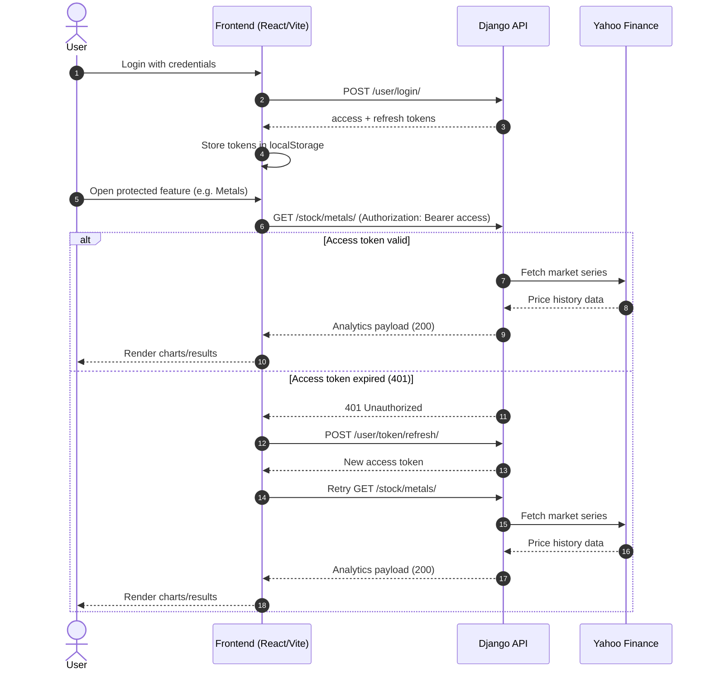

# SmartInvestors

SmartInvestors is a full-stack stock analytics platform built with Django REST Framework and React (Vite + TypeScript). It supports user authentication, portfolio and stock management, market data exploration, forecasting, and analytics-focused visualizations.

## Tech Stack

- Backend: Django 5, Django REST Framework, SimpleJWT, drf-yasg
- Frontend: React 18, TypeScript, Vite, React Router
- Data/Analysis: yfinance, pandas, numpy, scikit-learn
- Database (default): SQLite (`backend/stock_analysis/db.sqlite3`)

## Repository Structure

```
backend/stock_analysis/
  manage.py
  stock_analysis/      # Django project settings/urls
  user/                # Registration, login, profile, logout
  portfolio/           # Portfolio CRUD
  stock/               # Stock CRUD + analytics endpoints

frontend/
  src/
    api/               # API client with JWT refresh logic
    routes/            # App pages/features
    components/        # Shared UI components
```

## Features

- JWT authentication (register, login, refresh, logout, profile)
- Portfolio CRUD operations
- Stock CRUD operations under a portfolio
- Stock search suggestions (Yahoo Finance backed)
- Dashboard analytics by ticker
- Gold/Silver exploration with:
  - Growth comparison time series
  - Standardized correlation scatter datasets
  - Linear regression summaries
- Stock comparison analytics for two selected stocks
- Risk categorization for portfolio stocks
- Portfolio clustering endpoint
- Stock forecasting endpoint

## Local Setup

### 1) Backend Setup

From `backend/stock_analysis`:

```bash
python -m venv .venv
# Windows PowerShell
.\.venv\Scripts\Activate.ps1

# Copy env template and set real values
cp .env.example .env

pip install -r requirements.txt
python manage.py migrate
python manage.py runserver 0.0.0.0:8000
```

Backend base URL: `http://127.0.0.1:8000`

### 2) Frontend Setup

From `frontend`:

```bash
# Copy env template
cp .env.example .env

npm install
npm run dev
```

Frontend dev URL: `http://127.0.0.1:5173`

### 3) Frontend Proxy Behavior

Vite is configured to proxy `/api/*` requests to Django:

- Frontend request: `/api/user/login/`
- Proxied backend request: `http://127.0.0.1:8000/user/login/`

## API Documentation

When backend is running:

- Swagger UI: `http://127.0.0.1:8000/swagger/`
- ReDoc: `http://127.0.0.1:8000/redoc/`
- OpenAPI JSON endpoint: `http://127.0.0.1:8000/swagger.json`
- Saved schema file: `backend/stock_analysis/openapi.json`
- Docs can be disabled in production with `DJANGO_ENABLE_API_DOCS=0`

## Core Endpoints

### User

- `POST /user/` register user
- `POST /user/login/` login
- `POST /user/token/refresh/` refresh access token
- `POST /user/logout/` logout and blacklist refresh token
- `GET /user/profile/` get current user profile

### Portfolio

- `GET /portfolio/`
- `POST /portfolio/`
- `GET /portfolio/{id}/`
- `PUT /portfolio/{id}/`
- `PATCH /portfolio/{id}/`
- `DELETE /portfolio/{id}/`

### Stock

- `GET /stock/`
- `POST /stock/`
- `GET /stock/{id}/`
- `PUT /stock/{id}/`
- `PATCH /stock/{id}/`
- `DELETE /stock/{id}/`
- `GET /stock/search/?q=<query>`
- `GET /stock/metals/`
- `GET /stock/compare/?portfolio_id=<id>&stock1_id=<id>&stock2_id=<id>`
- `GET /stock/risk-categorization/?portfolio_id=<id>`
- `GET /stock/portfolio-cluster/?portfolio_id=<id>`
- `GET /stock/forecast/?portfolio_id=<id>&stock_id=<id>`

### Dashboard

- `GET /dashboard/{ticker}/`

## Sequence Diagram

The diagram below shows the frontend-to-backend request flow for authenticated calls with automatic token refresh.




## Notes

- Most business endpoints require JWT authentication.
- `MEDIA_URL` and `MEDIA_ROOT` are enabled for development file serving when `DEBUG=True`.
- Backend settings are environment-driven (`.env`) with a production entrypoint: `stock_analysis.settings_prod`.
- Frontend API base URL is environment-driven via `VITE_API_BASE_URL`.

## Production Deployment (Azure VM)

- Use the full runbook: `DEPLOYMENT_CHECKLIST.md`
- Backend production dependencies: `backend/stock_analysis/requirements-prod.txt`
- Gunicorn config: `backend/stock_analysis/gunicorn.conf.py`
